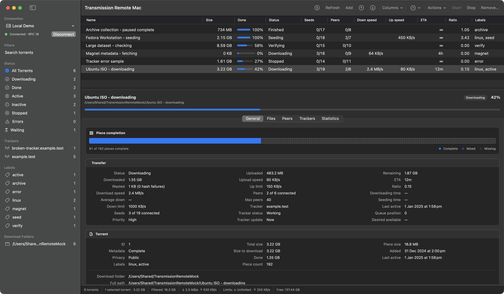

# Transmission Remote Mac

**Run Transmission on a server. Manage it from a proper Mac app.**

Transmission Remote Mac is a native macOS client for remote Transmission daemons. It keeps the dense, practical workflows that made Transmission Remote GUI so useful, without making you live in a browser tab.

## Why I built it

Transmission Remote GUI started as an [open-source SourceForge project](https://sourceforge.net/projects/transgui/). A [community fork](https://github.com/transmission-remote-gui/transgui) carried it onto GitHub, then [`lighterowl/transgui`](https://github.com/lighterowl/transgui) continued the line as what it called "a fork of a fork." That last fork was archived on 16 November 2025.

I had wanted a real Mac successor for years. Then I found myself at home recovering from an appendectomy, with time, a laptop and the same old thought: somebody should build this properly for macOS. So I did, with plenty of help from Codex.

This project is independent and is not an official Transmission client. It talks directly to Transmission RPC, keeps the desktop workflows transgui users already know, and uses native macOS controls and services throughout.

## See it running



_The screenshot uses the deterministic local mock RPC server. Those torrents are fictional, so nobody's download history has been sacrificed for the README._

## What works

- Persistent server profiles with macOS Keychain-backed passwords
- Transmission RPC session negotiation, capability gates, polling, and error handling
- Sortable torrent table, dynamic filters, torrent details, files, peers, and trackers
- Start, stop, queue, verify, reannounce, labels, location, rename, and removal actions
- Local `.torrent`, magnet, URL, and daemon-visible path add flows
- Torrent Properties and daemon settings editors with version-aware RPC payloads
- Per-server daemon-to-local path mappings for Finder actions

Bug reports, fixes and pull requests are welcome. [CONTRIBUTING.md](CONTRIBUTING.md) explains the code style, ownership rules and safe verification workflow.

## Built as a Mac app

- SwiftPM app for macOS 14+ on Apple Silicon
- SwiftUI for the app shell, sidebars, sheets, settings and detail panes
- AppKit where a dense desktop control genuinely needs it
- URLSession-based Transmission RPC client
- GPL-2.0-only code, with upstream attribution in `CREDITS.md`

Parity work is pinned to [`lighterowl/transgui`](https://github.com/lighterowl/transgui) revision `6b8a09eed8f5705c71dc39dd913c65a359dcfb1b`. When the project says a workflow matches transgui, it is comparing against a reproducible reference rather than whichever fork happens to be online that day.

## Familiar workflows, native architecture

Transmission Remote GUI is the behaviour reference, not an architecture template. Transmission Remote Mac carries over the RPC contracts, version gates, edge cases and workflows, but it does not copy the Lazarus UI structure. A transgui user should know where everything is, while the app itself should behave like it belongs on macOS.

## Install a GitHub release

The first GitHub release will be self-signed, not notarized by Apple and not signed by an identified Apple Developer. macOS may block its first launch. That is expected for this release model.

1. Download the app ZIP, GPL source archive, manifest and checksum file into the same folder.
2. Before opening the ZIP, verify the three checked files in Terminal:

```zsh
shasum -a 256 -c TransmissionRemoteMac-<version>+<build>-SHA256SUMS.txt
```

3. Use the exact checksum filename supplied with the release. A successful result confirms that the app ZIP, source archive and manifest match the files published by the project. It does not provide Apple notarization or identify an Apple Developer.
4. Move `TransmissionRemoteMac.app` to `/Applications`, then try to open it once.
5. If macOS blocks it, open **System Settings > Privacy & Security**, find the message for Transmission Remote Mac, click **Open Anyway**, then confirm the launch. Apple documents the same process in [Safely open apps on your Mac](https://support.apple.com/en-gb/102445).

### About the release certificate

The release process pins a fixed project-owned self-signed identity named `Transmission Remote Mac Release`, and each release manifest records its certificate fingerprint. The public certificate at `Resources/ReleaseSigningCertificate.cer` is tracked and distributed only as an identity pin and reference. It does not chain to Apple, does not make the app trusted by Gatekeeper, and must not be installed or trusted by users. Its matching private key remains maintainer-only and is never committed or distributed. If a download tells you to install a certificate, it is not following this project's release process.

### Passwords after an update

Saved server passwords should carry across future GitHub releases. When moving from an Apple Development-signed local build to the first public self-signed release, macOS may ask you to approve Keychain access or save the password once more.

## Build from source

```zsh
./script/build_and_run.sh
```

That command signs the app with a stable Apple Development identity, installs the current build at `/Applications/TransmissionRemoteMac.app`, and launches it.

Configure the identity once per checkout without committing personal certificate details:

```zsh
git config --local transmissionRemoteMac.codesignIdentity 'Apple Development: Your Name (TEAMID)'
git config --local transmissionRemoteMac.teamIdentifier TEAMID
```

`CODESIGN_IDENTITY` and `EXPECTED_TEAM_ID` environment variables can override those local values.

## Maintainer release workflow

The sections below are for maintainers cutting releases or proving the build. If you only want to use the app, you can stop reading here and go enjoy your torrents.

### Self-signed GitHub release

The initial public release will be a clearly labelled, non-notarized ZIP. Start from a complete, clean checkout tagged `v<VERSION>` at `HEAD`, then supply an explicit Apple-compatible build number:

```zsh
BUILD_NUMBER=1 ./script/release_unnotarized.sh
```

The script requires exactly one valid `Transmission Remote Mac Release` identity in the maintainer's signing Keychain. It builds the release app, signs it with that identity, validates the packaged bundle, and confirms that Gatekeeper rejects it as expected. It refuses a dirty or shallow checkout and will not overwrite existing release output.

Successful packaging writes four files to `dist/github-release`: the self-signed app ZIP, matching GPL source archive, manifest, and `SHA256SUMS.txt` file covering the other three. The manifest records the source commit, certificate fingerprint, notarization status, and expected Gatekeeper result. Publish all four files together on the matching GitHub release, without describing the app as Apple verified, Developer ID signed, or notarized.

### Optional Developer ID release

`script/release.sh` is the stricter maintainer path reserved for a future release backed by an Apple Developer Program membership. It only starts from a complete, clean checkout tagged `v<VERSION>` at `HEAD`. Supply the release build number explicitly using Apple's one-to-three-component `CFBundleVersion` format.

Configure the Developer ID identity, Team ID, notarytool Keychain profile, and
an executable final-artifact performance attester once per checkout:

```zsh
git config --local transmissionRemoteMac.releaseCodesignIdentity 'Developer ID Application: Your Name (TEAMID)'
git config --local transmissionRemoteMac.releaseTeamIdentifier TEAMID
git config --local transmissionRemoteMac.notarytoolProfile PROFILE_NAME
git config --local transmissionRemoteMac.performanceAttester /absolute/path/to/performance-attester
```

Then create the release from the tagged commit:

```zsh
BUILD_NUMBER=1 ./script/release.sh
```

The release script resolves the configured certificate name to exactly one certificate fingerprint, signs with hardened runtime and a secure timestamp, requires accepted notarization, staples the ticket, and validates the extracted final ZIP. It refuses shallow or dirty checkouts and never overwrites an existing release output. `PERFORMANCE_ATTESTER` can override the local attester configuration, but it must resolve to an executable regular file at an absolute path.

After the staged ZIP hash exists, `release.sh` copies the already-verified
attester bytes into a private executable snapshot and directly executes that
snapshot inside Seatbelt, without shell evaluation. The configured attester
must be one self-contained executable script or binary. It cannot depend on
companion files beside its configured path, use LaunchServices, daemonize,
detach descendants, or hand work to another service. Any child processes must
remain direct process-group descendants so the release script can completely
reap them before accepting evidence.

The attester receives `--artifact` as a read-only descriptor path,
`--artifact-file-name` as the canonical release filename, plus
`--artifact-sha256`, `--attester-sha256`, `--bundle-identifier`, `--version`,
`--build`, `--signing-leaf-sha256`, `--team-identifier`,
`--notarization-status`, and `--notarization-submission-id`. Filesystem writes
are permitted only inside the dedicated scratch directory exposed through
`HOME`, `TMPDIR`, and `TRANSMISSION_REMOTE_MAC_RELEASE_ATTESTER_SCRATCH`;
`/dev/null` is also available. Stdout is a bounded 64 KiB evidence channel and
must reach EOF. The attester must measure that exact final artifact and write
one UTF-8 canonical JSON object to stdout, using sorted keys, compact separators,
and one trailing newline:

```json
{"artifact":{"build":"1","bundleIdentifier":"net.pokwer.TransmissionRemoteMac","fileName":"TransmissionRemoteMac-1.0.0+1-macOS.zip","sha256":"0000000000000000000000000000000000000000000000000000000000000000","version":"1.0.0"},"attester":{"sha256":"2222222222222222222222222222222222222222222222222222222222222222"},"notarization":{"status":"Accepted","submissionId":"00000000-0000-0000-0000-000000000000"},"result":"passed","schemaVersion":1,"signing":{"leafSha256":"1111111111111111111111111111111111111111111111111111111111111111","teamIdentifier":"TEAMID1234"}}
```

The sample values above are illustrative, not valid evidence. The
script requires the JSON fields to exactly equal its own staged artifact,
bundle, version, build, signing leaf, Team ID, and accepted notarization
submission. It also binds the attester executable's SHA-256 before invocation,
verifies the private executable snapshot after capture, enforces timeout and
complete descendant cleanup, and freezes stdout only after EOF. Unknown fields,
noncanonical JSON, a non-passing result, artifact mutation, escaped output, or a
missing attester fail closed before publication. Failed release work is removed
automatically.

Each successful release emits a versioned notarized app ZIP, a matching GPL
source archive from the release tag, the canonical performance attestation, a
checksum file covering all three, and a manifest containing source, toolchain,
signing, notarization, packaged-input, and performance-attestation provenance.
The manifest records the attestation SHA-256, attester SHA-256, and passing
result. `Release ready` is printed only after every output is published
successfully.

## Development and verification

Run the standard checks:

```zsh
DEVELOPER_DIR=/Applications/Xcode.app/Contents/Developer swift test
python3 -m unittest -v script/test_mock_transmission_rpc.py
./script/build_and_run.sh --verify
```

### Safe mock daemon

To exercise mutation workflows without touching a real download queue, start the deterministic local mock:

```zsh
python3 script/mock_transmission_rpc.py --port 19091
```

Connect to `http://127.0.0.1:19091/transmission/rpc`.

The default fixture has six entirely fictional torrents. Scale and slow-RPC
fixtures are also available without contacting a daemon or touching real
download data:

```zsh
python3 script/mock_transmission_rpc.py --port 19091 --torrent-count 1000
python3 script/mock_transmission_rpc.py --port 19091 --torrent-count 100 --large-detail-torrent
python3 script/mock_transmission_rpc.py --port 19091 --torrent-count 0 --response-delay-ms 1500
```

`--large-detail-torrent` supplies one torrent with 10,000 deterministic files.
With a nonzero generated count it occupies the first slot, preserving the
requested total. Delta polling can start with `--recently-active-ids 1,2` and
`--recently-removed-ids 3`, and accepts both `recently-active` and
`recently_active` torrent selectors. Tests can replace the in-memory delta while
the mock is running:

```zsh
curl -X POST http://127.0.0.1:19091/__mock__/delta \
  -H 'Content-Type: application/json' \
  -d '{"changed":[4,5],"removed":[6]}'
curl http://127.0.0.1:19091/__mock__/state
```

The state endpoint reports per-method request counts, recently-active
`torrent-get` count, maximum concurrent requests, and the last torrent selector,
field count and request bytes. Delta controls mutate only the mock's memory.

The default mock workflow remains the legacy Transmission envelope. Advertise
RPC semver 6.0.0 on the session challenge to exercise automatic JSON-RPC 2.0
negotiation and snake_case payloads:

```zsh
python3 script/mock_transmission_rpc.py --port 19091 --rpc-version-semver 6.0.0
```

The same fixture, scale, delay and delta controls work under both protocols.

### Long performance acceptance

For a repeatable installed-app CPU and request-volume capture against the
1,000-torrent mock, run the long mock DEBUG acceptance mode:

```zsh
./script/capture_mock_performance.sh --mock-debug-acceptance
```

Mock DEBUG acceptance derives average CPU from process CPU-time delta over
wall time, samples connected CPU for 10 minutes, and requires average CPU below
1 percent and sampled p95 below 2 percent. It also samples hidden CPU for 10
minutes with an average below 0.2 percent. RPC gates cover active visible no
detail at most 14 calls per minute, one selected Overview detail at most 26
calls per minute, idle visible at most 5 calls per minute, hidden at most 4 list
polls plus one paired health probe per minute, and zero suspended background
calls. It records scheduler wakes during the visible and hidden windows, with
gates below 2 wakes per second and 0.1 wakes per second respectively. Headless
detail selection chooses the first visible torrent once, pins Overview, and
requires a matching runtime proof before measuring its 60-second RPC window.
Every CPU sample and every second of a sleep-only RPC measurement rechecks the
exact captured PID's declared active and hidden state; any mismatch invalidates
the whole labeled window. A short structural smoke is explicit and never
represents release acceptance:

```zsh
./script/capture_mock_performance.sh --smoke
# Equivalent: MODE=smoke ./script/capture_mock_performance.sh
```

The harness refuses to launch unless the installed signed app contains the
DEBUG-only performance password-store hook. It creates a one-use token inside a
temporary Foundation home, atomically consumes its request marker before writing
the exact runtime activation proof, and uses an in-memory no-op password store.
Reusing the same context or otherwise requesting invalid isolation fails closed
instead of falling back to Keychain, so the harness never queries or writes the
login Keychain. Normal DEBUG launches without the dedicated environment flag,
and all Release builds, continue to use the real Keychain.

App network access is sandboxed to the private loopback mock port. Every mock
RPC response is delayed 6 seconds, longer than the 5-second foreground poll
interval, so overlap is observable. The capture requires post-warmup
recently-active polling, reports per-method cadence and selector/field/byte
metrics, rejects startup's three calls as sufficient evidence, and requires a
maximum of one accepted RPC in flight. Its exit trap rechecks real profile and
defaults fingerprints even after an early capture failure, then removes all
temporary state. Each phase copies the installed DEBUG app, gives the copy an
isolated bundle identifier, and ad-hoc signs that copy before launch.

Passing the long gates emits `mock_debug_acceptance=passed`, followed by
`release_acceptance=blocked`. This harness measures an isolated DEBUG copy, not
either packaged Release artifact. It cannot prove the planned non-notarized ZIP
or a future Developer ID-signed, notarized ZIP. `--release` and `MODE=release`
are rejected so this mock harness cannot be used to greenlight either release
path.

## License

Released under the GNU General Public License version 2. See [LICENSE](LICENSE) for the terms and [CREDITS.md](CREDITS.md) for upstream attribution.
